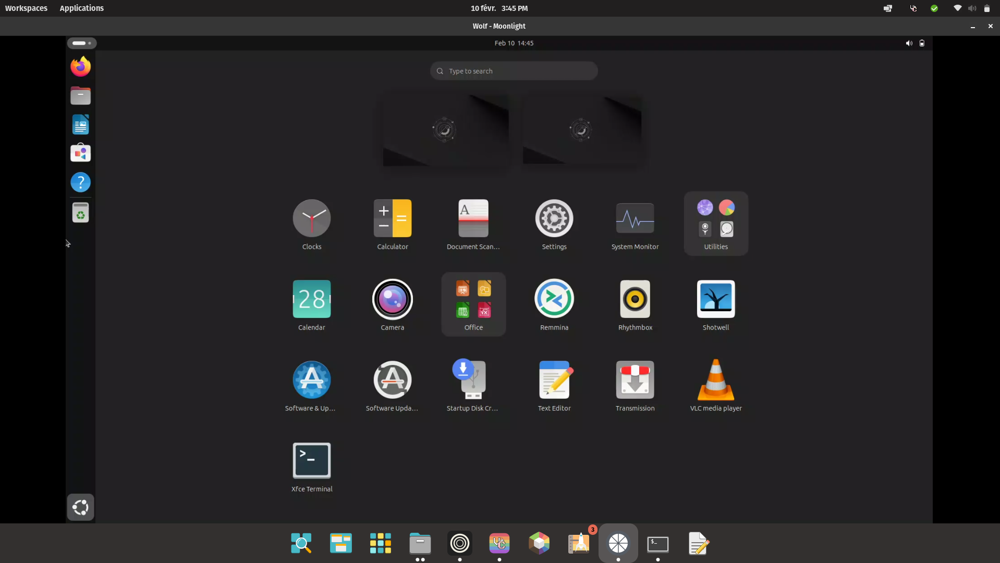

# Ubuntu Desktop GOW



An experimental Ubuntu desktop image for Wolf, including Flatpak support.

## Features
- Provides an Ubuntu desktop environment within Wolf.
- Supports Flatpak applications.
- Persists only the home folder, including installed Flatpaks.

## Limitations
- Only the home folder is saved (including Flatpaks).
- Currently supports only a 1920x1080 resolution.

## Known Issues
- GNOME Terminal does not launch; XFCE Terminal is installed as a replacement.

## To-Do List
- Implement support for custom resolutions.

## Quickstart
To add Ubuntu Desktop GOW to your Wolf configuration, modify the `/etc/wolf/cfg/config.toml` file under `[[apps]]`:

```toml
[[apps]]
start_virtual_compositor = true
title = 'Ubuntu'

    [apps.runner]
    base_create_json = '''{
  "HostConfig": {
    "IpcMode": "host",
    "CapAdd": ["SYS_ADMIN", "SYS_NICE", "SYS_PTRACE", "NET_RAW", "MKNOD", "NET_ADMIN"],
    "SecurityOpt": ["seccomp=unconfined", "apparmor=unconfined"],
    "Ulimits": [{"Name":"nofile", "Hard":10240, "Soft":10240}],
    "Privileged": false,
    "DeviceCgroupRules": ["c 13:* rmw", "c 244:* rmw"]
  }
}
'''
    devices = []
    env = [ 'GOW_REQUIRED_DEVICES=/dev/input/* /dev/dri/* /dev/nvidia*' ]
    image = 'ghcr.io/mollomm1/gow-ubuntu:main'
    mounts = []
    name = 'UbuntuDesktop'
    ports = []
    type = 'docker'
```

After modifying the configuration, restart Wolf:

```bash
docker restart wolf
```

## Building the Container
To build the container from scratch, run the following command:

```bash
sudo DOCKER_BUILDKIT=1 docker build --no-cache -t gow-ubuntu .
```

## Contributing
Feel free to submit issues or pull requests to improve this project!

